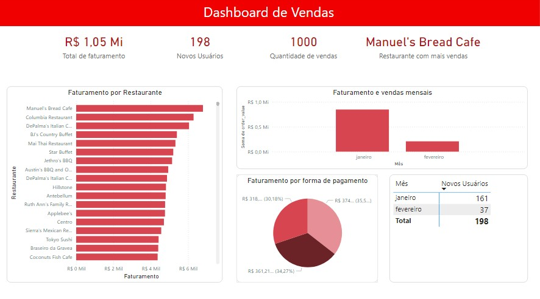

# Data Analytics: Food & Delivery
--
## Processo de análise de dados realizado em ferramentas de ETL e visualização de dados.
Inicialmente é realizado a modelagem dos dados através de um MER (Modelo Entidade Relacional), seguido da criação do banco de dados na ferramenta do Microsoft SQL Server. Adiante, é feito o processo de três fases do ETL:

  * Extract: Coleta da base de dados de <a href="https://www.kaggle.com/datasets/romanniki/food-delivery-cost-and-profitability" target="_blank">Food Delivery Cost and Profitability</a> através do site da Kaggle;
  * Transform: A limpeza e organização dos dados foi realizado pela ferramenta Alteryx, a fim de transformá-los em dados utilizáveis;
  * Load: Os dados são inseridos no banco de criado anteriormente.

Por fim, o banco de dados foi conectado à ferramenta Power BI para que as informações possam ser visualizadas e analisadas através de um dashboard interativo.

## Ferramentas utilizadas

## Como utilizar?
1. Clone esse projeto;
2. Abra a pasta de "SQL Server" e abra o arquivo "Food_and_Delivery.sql" e rode o script;
3. Acessa a pasta "Alteryx", abra o arquivo "Food_and_Delivery.yxmd", aponte os caminhos corretos de entrada (Food_orders_new_delhi.csv) e saída dos dados (o banco de dados SQL);
4. No arquivo do Power BI (food_and_delivery.pbix), como fonte de dados, faça conexão direta com o banco de dados ou utilize o arquivo "food_and_delivery.xlsx" na pasta "Excel".

## Imagem do Dashboard

## Ficou em dúvidas sobre a modelagem de dados?
Na pasta de documentos, encontrá-se a parte de documentação do projeto: um MER e dicionário de dados.

